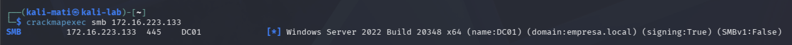
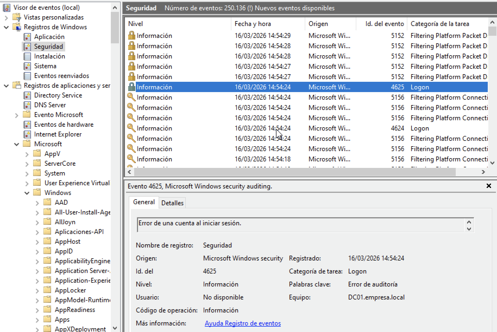
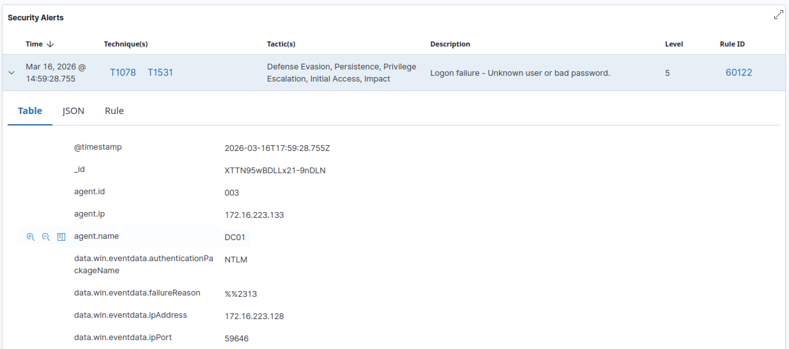
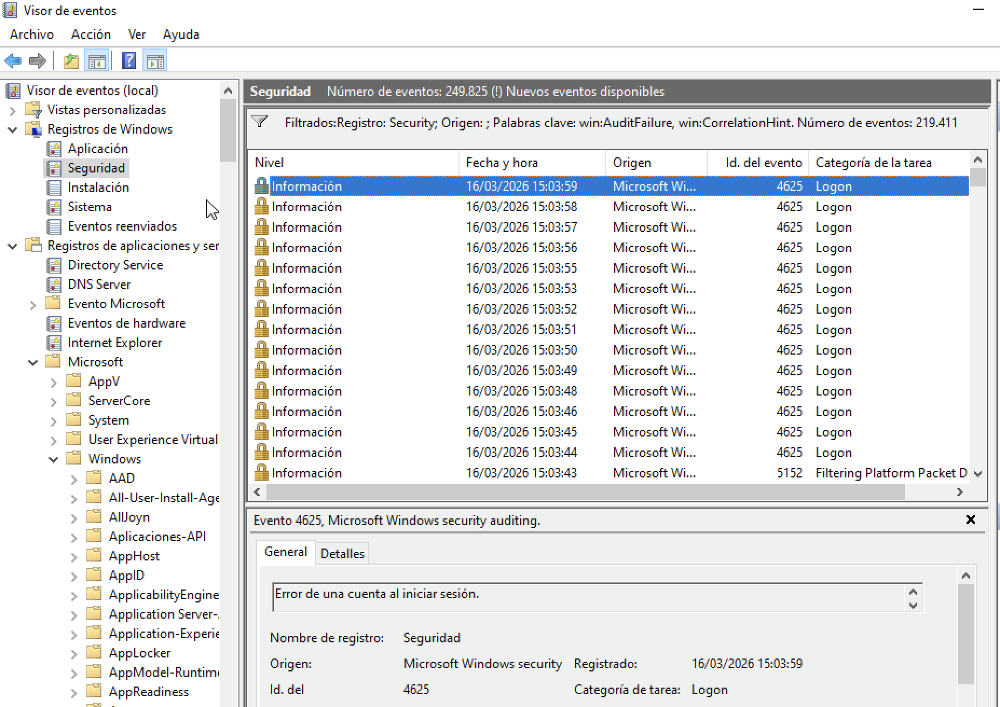
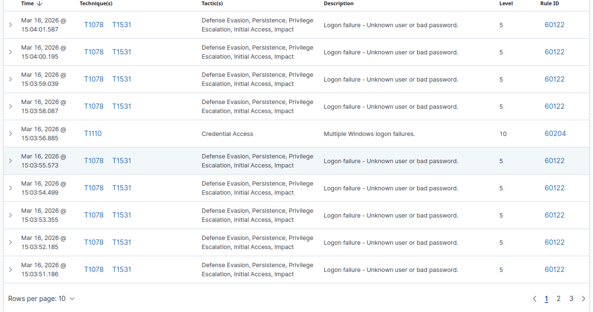

# SOC Incident Report

## Incident Overview

Incident Name:
Password Spraying Attempt

Date Detected:
16/03/2026

Detection Source:
Wazuh SIEM

Severity:
Medium

Target System:
Domain Controller – 172.16.223.133

Source IP:
172.16.223.128 (Kali Attacker Machine)

---

## Executive Summary

The Security Information and Event Management (SIEM) platform detected multiple authentication failures targeting the Domain Controller.

The activity originated from a single source IP address and consisted of repeated SMB authentication attempts using an incorrect password.

The pattern of authentication attempts indicates a potential **password spraying attack**, a common technique used by attackers to gain unauthorized access to domain accounts.

---

## Attack Simulation – SMB Service Verification

The attacker first verified the availability of the SMB service on the Domain Controller.

Tool used:
CrackMapExec

Command executed:

crackmapexec smb 172.16.223.133

This command attempts to connect to the SMB service (port 445) on the target system.

Expected output confirms:

- the host is reachable
- SMB service is running
- the attacker can communicate with the Domain Controller

---

## Initial Authentication Attempt

The attacker performed an authentication attempt using invalid credentials.

Command executed:

crackmapexec smb 172.16.223.133 -u administrador -p wrongpass

This authentication attempt generated a Windows security event.

Observed event:

Event ID 4625 – Failed Logon

This event indicates that an account failed to log on to the system.

The event was collected by the SIEM platform.

---

## Attack Simulation – Password Spraying

To simulate an authentication attack, the attacker generated multiple login attempts against the Domain Controller.

Command executed:

for i in {1..20}; do crackmapexec smb 172.16.223.133 -u administrador -p wrongpass; done

This activity produced multiple authentication failures recorded in the Windows Security logs.

Observed behavior:

- repeated login attempts
- authentication failures from the same source IP
- high frequency of Event ID 4625

### Windows Security Events

### SIEM Detection

The Wazuh SIEM successfully collected and displayed these events.

---

## MITRE ATT&CK Mapping

The observed activity corresponds to the following MITRE ATT&CK technique:

Tactic:
Credential Access

Technique:
Password Spraying

Technique ID:
T1110.003

---

## Security Impact Assessment

Password spraying attacks are commonly used by adversaries to attempt access to domain accounts while avoiding account lockout mechanisms.

If successful, this technique may allow attackers to gain unauthorized access to enterprise systems and escalate privileges within the network.

Early detection of repeated authentication failures is critical to prevent potential compromise of domain accounts.

---

## Recommended Security Actions

• Implement account lockout policies to mitigate brute force attacks.  
• Monitor repeated authentication failures across domain accounts.  
• Restrict SMB access to trusted hosts and networks.  
• Implement SIEM correlation rules to detect password spraying activity.  
• Investigate repeated authentication failures originating from a single host.

---

## Conclusion

The simulated attack successfully generated authentication failure events on the Domain Controller.

The SIEM platform detected and collected the events, allowing security analysts to identify suspicious authentication activity.

Continuous monitoring of authentication logs and proactive detection rules are essential to mitigate credential-based attacks in Active Directory environments.