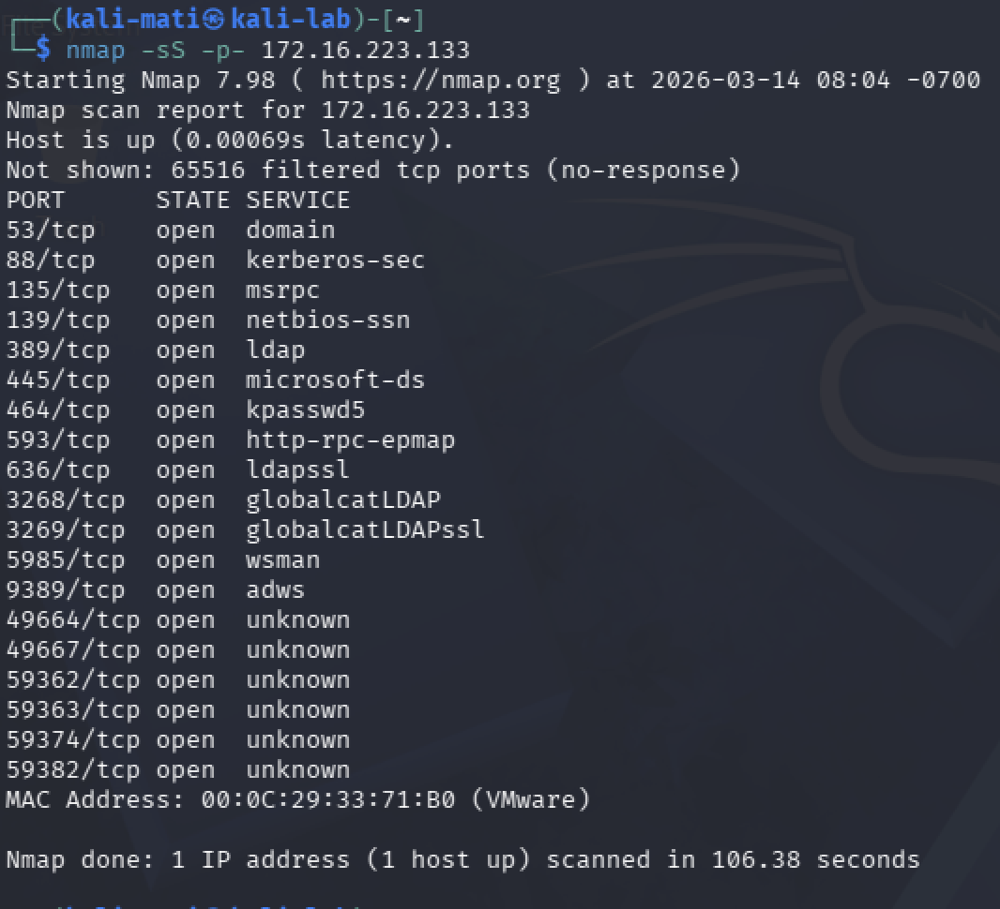
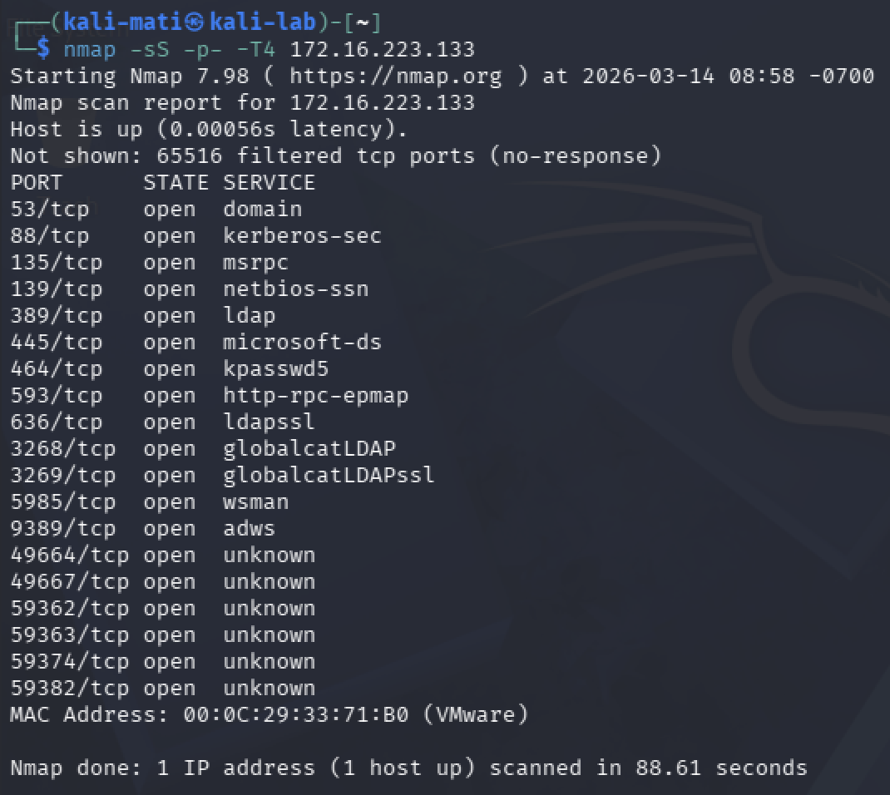
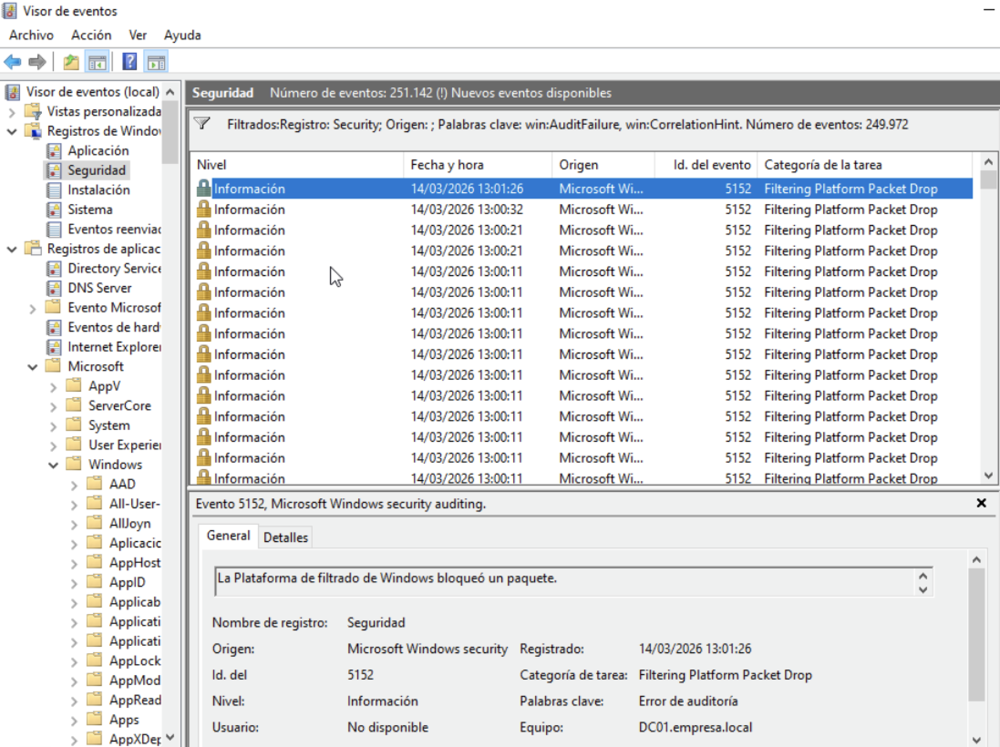
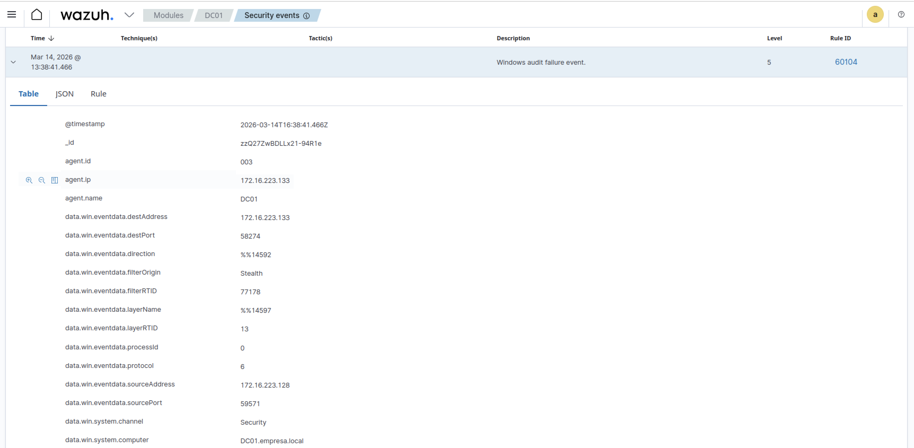
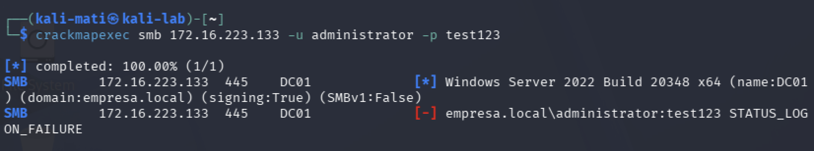
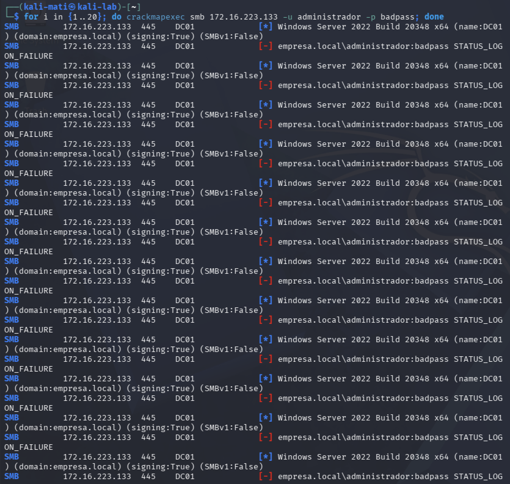
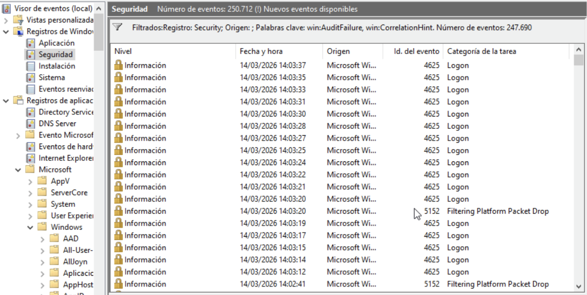
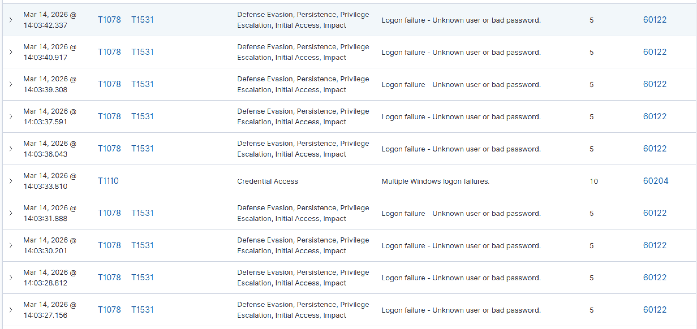
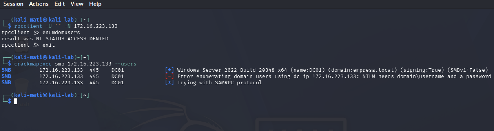
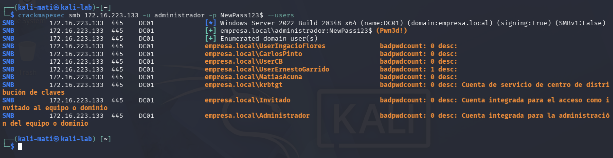

## Attack Simulation – Network Scan

The attacker machine executed a network scan against the Domain Controller.

Command used:

nmap -sS -p- 172.16.223.133

Purpose:

Identify open ports and services running on the server.

## Simulación de ataque – Escaneo de puertos

La máquina atacante ejecutó un escaneo de puertos completo contra el controlador de dominio.

Comando utilizado:

nmap -sS -p- -T4 172.16.223.133

Este escaneo intenta identificar servicios y puertos abiertos en el sistema objetivo.

## Detección en Windows

Durante el escaneo de puertos ejecutado desde la máquina atacante, el firewall del servidor registró múltiples eventos de bloqueo.

Evento observado:

Event ID 5152 – Filtering Platform Packet Drop

Este evento indica que la plataforma de filtrado de Windows bloqueó paquetes de red generados por el escaneo.

## Detection in Wazuh

The Wazuh SIEM detected network activity generated by the Nmap scan.

Events collected from the Domain Controller show blocked network packets by the Windows Filtering Platform.

Example event:

Rule ID: 60104  
Description: Windows audit failure event

Source IP: 172.16.223.128 (Kali attacker machine)  
Destination IP: 172.16.223.133 (Domain Controller)

## Attack Simulation – Brute Force Authentication

The attacker machine attempted multiple failed logins against the Domain Controller.

Tool used:
crackmapexec

Command executed:

crackmapexec smb 172.16.223.133 -u administrador -p badpass

# Generate many events

You can make several attempts:

for i in {1..20}; do crackmapexec smb 172.16.223.133 -u administrador -p badpass; done

# This generated multiple Windows Security events:

Event ID 4625 – Failed Logon

The Wazuh SIEM collected these events from the Domain Controller and displayed them in the dashboard.

## Attack Simulation – Domain User Enumeration

The attacker attempted to enumerate domain users using RPC queries.

Command executed:

rpcclient -U "" -N 172.16.223.133

Inside the RPC session:

enumdomusers

The attempt failed because the Domain Controller does not allow anonymous enumeration.

Result:

NT_STATUS_ACCESS_DENIED

This indicates that the Active Directory environment is configured to prevent anonymous user enumeration.

## Attack Simulation – Domain User Enumeration

The attacker used CrackMapExec to enumerate domain users after authenticating against the Domain Controller.

Command used:

crackmapexec smb 172.16.223.133 -u administrador -p NewPass123$ --users

The command successfully authenticated to the Domain Controller and enumerated domain accounts.

This activity corresponds to MITRE ATT&CK technique:

T1087 – Account Discovery

The activity generated Windows security events that were collected by the Wazuh SIEM.

## Security Recommendations

To mitigate these types of attacks, the following controls are recommended:

• Implement account lockout policies to prevent brute force attacks.
• Restrict SMB access to trusted networks.
• Enable advanced monitoring for authentication failures.
• Use SIEM correlation rules to detect repeated failed logon attempts.
• Monitor port scanning behavior across internal networks.

## Conclusion

This laboratory demonstrated how reconnaissance and authentication attacks against a Domain Controller can be detected using a SIEM platform.

By analyzing Windows security events and firewall logs, it was possible to identify network scanning activity, brute force login attempts, and account enumeration behavior.

The Wazuh SIEM successfully collected and visualized these events, allowing security analysts to investigate potentially malicious activity in real time.