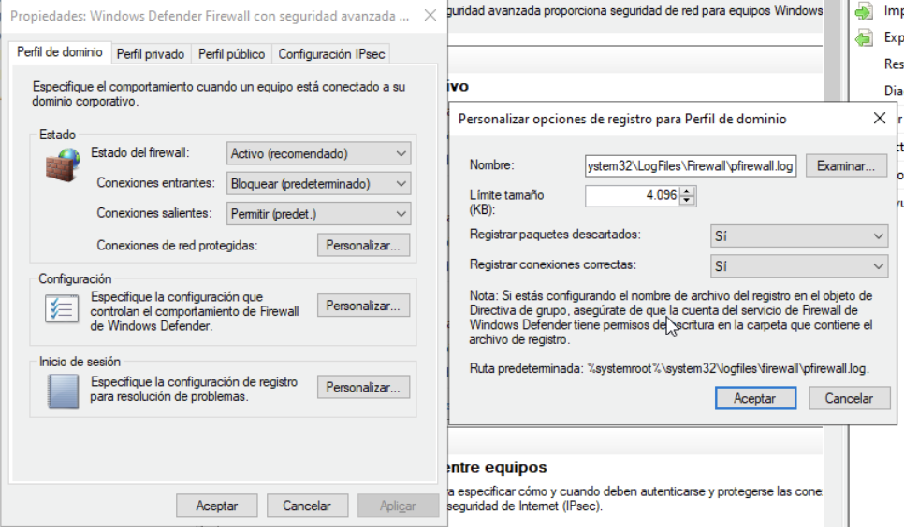
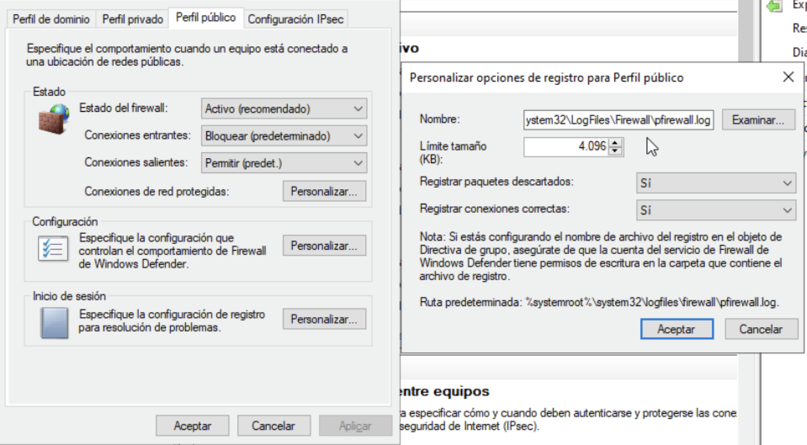
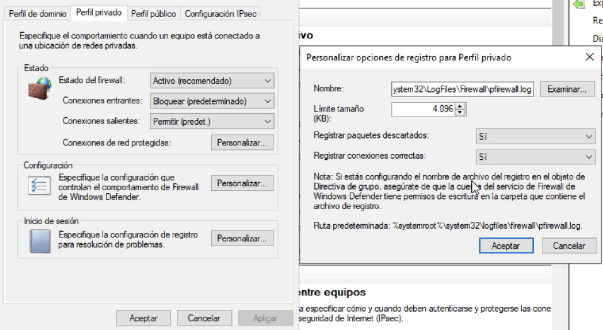
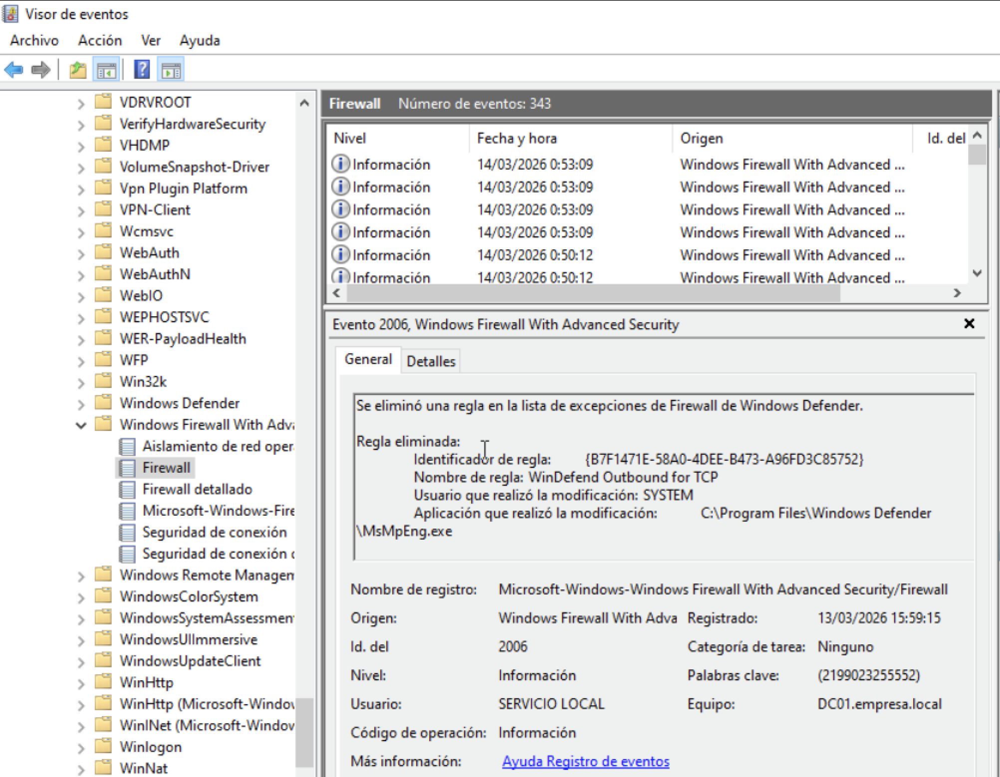

# Windows Firewall Configuration – SOC Lab

This section documents the configuration of Windows Defender Firewall to detect reconnaissance and attack activity.

The firewall was configured to log blocked connections so that network scans and unauthorized access attempts can be detected by the SIEM.

Environment:

- Wazuh SIEM (Ubuntu)
- Windows Server 2022 Domain Controller
- Kali Linux attacker machine

## Firewall Logging

Firewall logging was enabled to detect reconnaissance and unauthorized connection attempts.

Log location:

C:\Windows\System32\LogFiles\Firewall\pfirewall.log

## Firewall Events in Windows

The firewall logs connection attempts and blocked packets.

These events can be analyzed in Windows Event Viewer.

## Firewall Audit Configuration

To log connection attempts and suspicious network activity, Windows Filtering Platform audit policies have been enabled.
Configuration path:

Local Policies  

→ Advanced Audit Policy Settings  
→ System Audit Policies  
→ Object Access  

Enabled policies:

- Audit Filtering Platform Connection
- Audit Filtering Platform Packet Filtering

These settings allow network events to be logged in the Windows Event Viewer.

