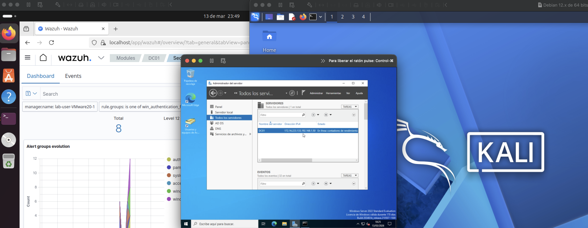
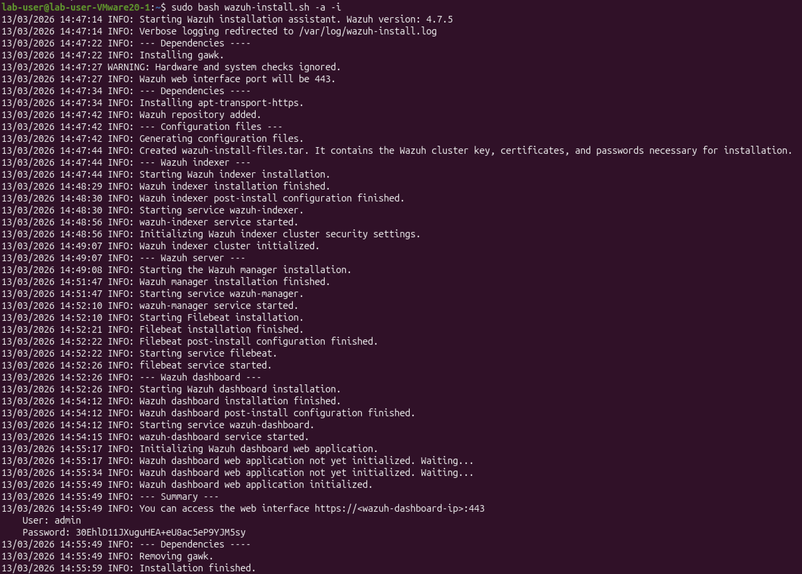
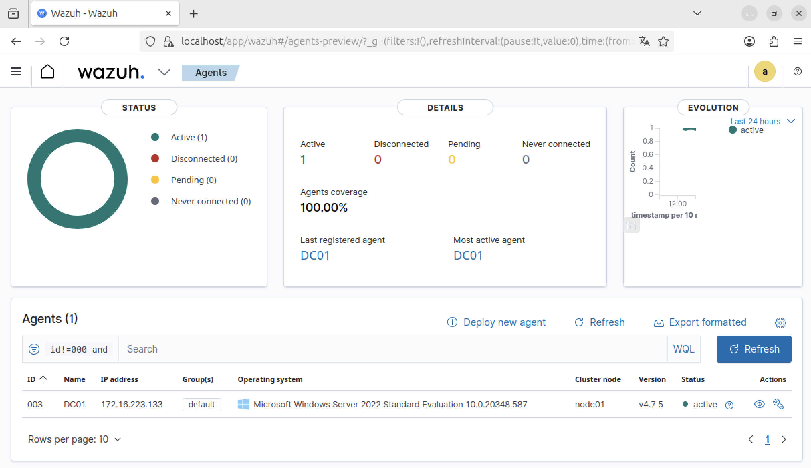
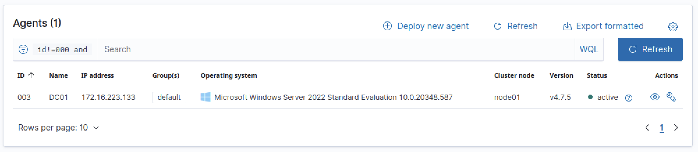

# SOC Lab – Wazuh SIEM Monitoring Active Directory

## Lab Objective

The objective of this lab is to simulate a small enterprise environment and demonstrate how a SIEM platform can detect security events from a Windows Domain Controller.

---

## Lab Environment

| Machine | Role |
|------|------|
| Ubuntu | Wazuh SIEM |
| Windows Server 2022 | Domain Controller + Wazuh Agent |
| Kali Linux | Attacker Machine |

---

## Network Architecture

Kali Linux → Windows Server → Wazuh SIEM

## Lab Architecture

The lab environment consists of three virtual machines connected in the same virtual network.

## Wazuh Installation

The SIEM platform was installed on an Ubuntu virtual machine.

Command used:

curl -sO https://packages.wazuh.com/4.7/wazuh-install.sh

sudo bash wazuh-install.sh -a

This command installs:

- Wazuh manager
- Filebeat
- OpenSearch
- Wazuh Dashboard

### Installation Process

## Wazuh Dashboard

After installation, the Wazuh dashboard can be accessed from the browser.

Example URL:

https://localhost/

The dashboard provides centralized visibility of security events.

## Agent Deployment

The Wazuh agent was installed on the Windows Server (Domain Controller).

Manager IP:

172.16.223.132

PowerShell command used to authenticate the agent:

& "C:\Program Files (x86)\ossec-agent\agent-auth.exe" -m 172.16.223.132

Once connected, the agent appears as active in the Wazuh dashboard.

